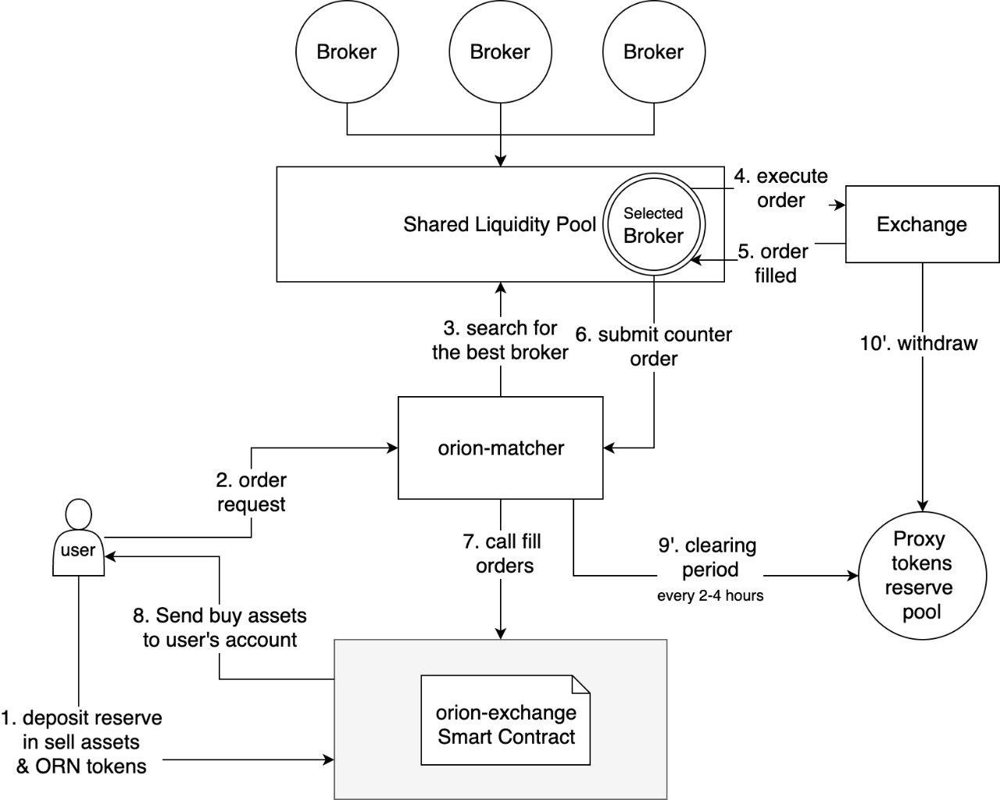

##### Table of contents
* [Orion Protocol overview](#orion-protocol-overview)  
* [Orion Protocol architecture](#orion-protocol-architecture)  
* [Orion Protocol: components and modules](#orion-protocol-components-and-modules)
  * [Order matching engine](#order-matching-engine)
  * [Multi-currency wallet](#multi-currency-wallet)
  * [Price monitor](#price-monitor)
  * [Portfolio management](#portfolio-management)
  * [Crypto index funds module](#crypto-index-funds-module)
  * [Liquidity lending module](#liquidity-lending-module)
* [dApps marketplace](#dapps-marketplace)
  * [Example scenarios](#example-scenarios)


# The Orion Protocol

_Orion will be open sourcing some of its core components to the Orion Foundation. The Orion Protocol is the name of the underlying protocol on which the Orion platform runs. This will mean standardising the API and architecture of the platform’s liquidity aggregator protocol._

_Ultimately, the intention is to create a combined protocol for connecting to both centralised and decentralised exchanges. This will enable secure trading across blockchains, accessing liquidity from across the entire sweep of the crypto markets._

## **Orion Protocol overview**

The Orion Protocol is a standard for connecting to centralised and decentralised exchanges’ orderbooks, allowing the creation of dApps to provide robust services for buying and selling any cryptocurrency at the best price the market has to offer at the time. There is no other protocol that exists in the market right now which does this. A few that do are specific to DEX and only for Ethereum (0x protocol for example). Orion protocol can support multiple currencies, both DEX and centralized exchanges.

There is a growing need in the crypto world for secure, reliable, trustless cross-blockchain exchanges. Orion unifies connections to many existing exchanges, providing standardised API access to all of them. Whilst every exchange has differences in data formats and methods of connection and making calls, Orion will hide these behind one single API format.

Beyond this standardisation, the platform will provide smart routing and price splitting functionality, searching out the best price and required liquidity across every exchange. Thus a large order may be split into smaller segments and executed across different exchanges, even if any single exchange lacks the orderbook depth to fulfil the whole trade at once. Especially for less popular pairs and more thinly-traded markets, this solves the problem of slippage and poor execution price.

The Orion Protocol also includes modules for standardising portfolio management, storing, tracking and calculating profit and loss for executed trades; for managing crypto index funds; and for providing liquidity for lending.

## **Orion Protocol architecture**

The Orion Protocol uses a modular architecture of distributed and decentralised services that fulfil all their settlement on the Waves blockchain. The result is that these services and components can provide exceptional performance as well as the ultimate security of being verified by the blockchain, with funds locked and secured by smart contract. One of the additional advantages of this best-of-both-worlds approach is that modules can be updated and substituted without affecting the overall functioning of the protocol, so no downtime is necessary when improvements are made.


The majority of Orion’s core components will be open-sourced to the Orion Foundation, which has a number of purposes. Firstly, the Orion Protocol will standardise the API for the different elements of its liquidity aggregator, providing a common ‘language’ for connecting to any exchange. 

Secondly, Orion will create a marketplace for dApps built on top of its protocol. Some examples of dApps that might be built include:

* Arbitrage apps
* Algorithmic trading bots
* Investment funds
* Payment integration systems

The network of components that comprise Orion’s marketplace can be developed and enhanced by third parties, ensuring greater quality and availability of functionality. Developers can earn an income when others use their modules. For example, anyone can create a Price Discovery Module for a new exchange and join the Orion network. They will be rewarded for providing this service with HDL tokens. Participation in the Orion ecosystem also has the benefit of sharing liquidity across the network and new exchanges.

Orion is the first reference implementation of all of the core components of the Orion Protocol, as well as being the first and major liquidity provider. Over time, more implementations will be added and will work in parallel to Orion – improving reliability, performance and stability of the protocol. 

From a technical standpoint the Orion Protocol complies with a microservices architecture in which all components are independent services or daemons that register themselves in the Orion registry and are discoverable by clients. E.g. a price service for a new exchange is simply a standalone service with its own database that implements the standardised Price module API, and adapts the API of that particular exchange, hiding any differences inside the module.

## Orion Protocol: components and modules

### **Order matching engine**

The task of the order-matching engine is to ensure that trades are executed at the most advantageous price by accessing the lowest asks and highest bids across all available exchanges.

When a new order is received, the engine first tries to execute it on the internal orderbook. If this does not give the best price it then uses data provided by the Price Discovery Module to find the exchange or exchanges to which the order should be sent, depending on the required amount and the depth profile of each exchange. 

Based on the results of this analysis the order is split up and submitted to the relevant exchanges. \(To fill a large order, or an order for a less-popular pair, the trade will typically be split into small pieces across a number of different exchanges; in other circumstances, one exchange might offer the best price for the amount required.\) Following successful execution these trades are consolidated and the client is notified of the completion of the order.


Orders can have one of the following statuses:

* New
* Accepted
* Filled
* Partially filled
* Cancelled
* Partially cancelled


The following is an example of an interface description of the protocol order format. Smart routing and price splits are automatically included:

```javascript
interface Order {
    // Client(dApp) address in the system
    clientAddress: string;  
    // The traded currency pair, e.g. BTCUSD,ETHBTC, etc.
    symbol: string;
    // Order side: Buy/Sell
    side: string;
    // The amount in units of the base currency the Client wants to buy/sell on exchange     	
    amount: decimal;
    // Limit price 
    price: decimal;
    // The address of the Orion Protocol escrow smart contract
    escrowAddress: string;
    // How many HDL tokens the Client will pay as a fee
    protocolFee: double;
    // Order type: Market, Limit, Stop, StopLimit and others
    ordType: string;
    // Time in force: GoodTillCancel, FillOrKill, GoodTillDate, etc. 
    timeInForce: string;
    // Order expiration time (unix timestamp in seconds)
    expirationTimestamp: integer;
    // The order status: 
    status: string;
    // Actual filled order amount in base currency
    actualAmount: decimal;
    // Actual order cost in quote currency
    actualCost: decimal;
} 
```

The trading interface supports different order modes, including fillOrKill, market and limit orders. 

A ‘smart search’ is used to discover the right exchanges for the order – that is, the ones with the right combination of price and liquidity. When the Order Matching engine splits the initial order and finds the best exchanges on which to execute them, the final step is to find ExchangeExecutors that eventually create, submit and watch for filling of the native orders. The Orion Protocol unifies the process for working with both centralised and decentralised exchanges, leaving all the differences to be dealt with only by the specific executors. \(In short, CEX executors work with API keys where DEX executors sign orders write from the multi-currency wallet using a private key.\)

There two principally different mode of executors: a direct executor, which works with the funds held on their own accounts \(either via API key or a private key\); and proxy executors that lend the required funds via a shared liquidity pool, for circumstances in which a dApp does not have enough liquidity of its own on a particular exchange. Clients can therefore use their own funds on exchanges, in which case they will first need to provide API keys to give the engine access, or lend funds to a liquidity pool on different exchanges.

#### Centralised exchanges

The centralised ExchangeExecutor is simply an adapter for a particular exchange that can send Buy or Sell limit orders using the provided API key, and monitor them for fulfillment.

#### Decentralised exchanges

A decentralised exchange \(DEX\) module is designed to connect to a DEX in the same way that the order-matching engine connects to a centralised exchange. The nature of a DEX and the way it operates means that the API functions very differently and additional concerns must be considered. The ExchangeExecutor for a DEX uses a private key provided by a multi-currency wallet \(see below\) to generate, sign and validate transactions tailored for the DEX on different blockchains. Because the transactions are signed before sending, the private key does not need to be exposed to the web. Nevertheless, security for this operation is paramount.

Where orders are executed internally, e.g. on Orion’s internal DEX, atomic swaps can be used. These employed Hashed Timelock Contracts \(HTLC\) to exchange pre-determined amounts of cryptocurrency in their entirety \(hence ‘atomic’\), or not at all. Partial orders are not possible.

### Multi-currency wallet

A multi-currency wallet comprises a set of tools that is stored securely on the client's computer or mobile phone, and that supports different cryptographic functions and connectivity for many blockchains. Support for new currencies will be added gradually with the help of the Orion development community. 

A set of easy and user-friendly tools will be integrated with the Orion Protocol, such as functionality for depositing and withdrawing currencies; sending HDL tokens to the escrow smart account; signing DEX orders for ExchangeExecutors; and integration with a Portfolio management module to provide a history of operations and calculate the cost and profit of trades, amongst others.

### Price monitor

A price monitor module comprises a pluggable architecture that offers a feed of live prices from exchanges in real time. A new plugin can easily be written by creating a simple interface and presenting exchange information within it. The module displays last price but also analyses exchange orderbooks to show volumes and depths. Whenever possible it attempts to update and push results to the user, connecting to the exchange via web socket. When not available it falls back to using a pull-based mechanism, constantly checking the exchange’s REST API.

The price discovery module also aggregates and interprets historical prices, giving a feed to connected clients and a UI with prices for plotting charts by different time-frames and periods.

Providing price data will be charged in HDL tokens from the client. Developers can run their services with 99.9% uptime, receiving a fee for providing that data.

### Portfolio management

The portfolio management module supports a range of functions for smart portfolio use, including trading history, current balance, and profit/loss. It also allows users to compare different trading strategies.

### Crypto index funds module

This module consists of the set of API calls required to create a custom index fund, providing a list of currencies and the proportion of the index they comprise in percentage terms. Indices can be public or private. The module also includes the API calls needed to buy/sell each index, which are internally unpacked into separate orders relating to their underlying currencies and submitted to exchanges for execution by the Order matching engine. Additionally, there are APIs for price feeds using the prices of each constituent currency.

### Liquidity lending module

When a client using the protocol does not have sufficient funds on certain exchanges, he can opt in to lend the necessary liquidity to a common pool. All final settlements are performed on the Waves blockchain and guaranteed by a purpose-designed Smart Contract Escrow Account.

When a pool receives a request to execute a given order, it searches the stakeholder\(s\) able to execute it based on various criteria such as the rating of each stakeholder, its fees, available funds etc. Once found, stakeholders execute requested orders from their account on the centralised or decentralised exchange. During execution the order is guaranteed by a Smart Contract Escrow Account, so that the parties receive the full amount of the right currency and their HDL tokens for the commission fee. 



The client first needs to deposit the necessary amount of the currency to sell and HDL tokens to the Smart Contract Account with a time lock. Within that amount he can execute trades and create a portfolio. 

All lenders provide their stake for overall liquidity \(common pool\). When they receive requests from the Order matching engine they execute trades on their own account on the relevant exchange. Lenders receive fees in HDL, when the initial request is fully closed. This can be done in two ways:

* The lender withdraws bought currencies to an external address, and provides proof with the transaction hash to the Waves Smart contract address to unlock sell currencies and HDL tokens for commission fees.
* The counter order is received that closes the initial open trade. The lender then receives a commission fee in HDL.

## **dApps marketplace**

A wide variety of applications can be created for the Orion Protocol, including for investment, trading bots and payment gateways. The Protocol will be used extensively for every decentralised application in the marketplace. The first dApp running on the Orion Protocol will be Orion itself, the reference implementation that will provide a liquidity aggregator, portfolio management and an ICO platform. Within Orion’s dApps HDL will function as a utility token, being used to pay for all services, including for commission fees and within its lending model.

### **Example scenarios**

#### **Scenario 1**

**A blockchain fund wants to buy a total of 10 BTC of Ethereum:**

1. The fund sends 10 BTC to the Orion Smart Account address with a time lock period \(depending on the blockchain parameters of the received currency\). It can choose to pay trade fees in HDL tokens, or subtract this from the BTC amount.
2. A Send request is made to the Order matcher to buy Ethereum for the total amount of BTC, also providing an Ethereum address.
3. The Order matcher splits this across three exchanges: the Waves DEX, Bittrex and Poloniex.
4. The three orders are executed. Three withdrawal requests are initiated, and so there will be three ETH transactions to transfer the resulting funds to the Buyer’s address.
5. A transaction hash for each of these three transactions is provided as proof in order to unlock the BTC from the Orion Smart Account address. The transfer from that address can be made only by the stakeholders who provided liquidity to execute corresponding orders on exchanges.
6. If for some reason a buyer hasn’t received the ETH to his account after the lock period ends, he can receive the locked BTC back.

#### **Scenario 2**

**A multi-currency terminal provides the following functionality to users:**

1. Subscribe to the service
2. Pay monthly fee in HDL token
3. Relevant exchanges and altcoins of interest can be selected
4. Real-time price feeds are delivered

#### **Scenario 3**

**Trading using funds held by the dApp itself:**

1. The dApp deposits HDL tokens to an account used for fee payment.
2. The dApp send a request to buy/sell a given amount of a particular currency, providing the API key for exchanges where it has funds.
3. The Order matching engine module finds the best prices across the relevant markets, splits the initial order and returns the list of orders to be submitted to different exchanges.
4. The dApp must provide an API key for a CEX with sufficient funds on account, and  a signed order must be submitted to DEXs using a private key from a local multi-currency wallet. All orders are executed by corresponding direct  ExchangeExecutors.
5. The OrderWatcher is notified about the status of each order. The fee in HDL tokens is deducted from the dApp account for filled orders.
6. Filled trades are published to the Portfolio management module for further tracking and analysis. The purchased coins remain on the dApps exchange account until withdrawn, or in the cold wallets for DEX trades.

